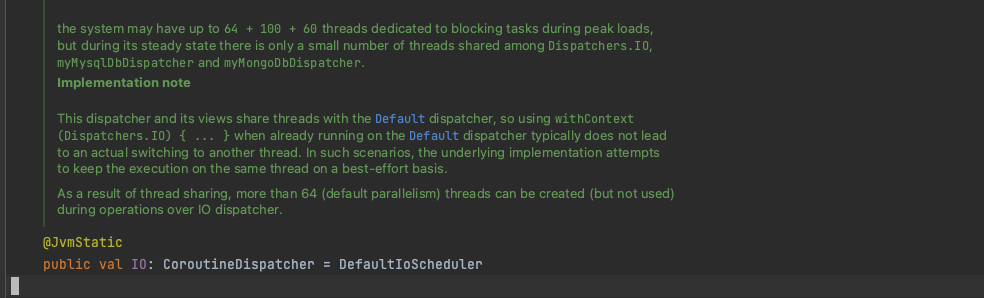

# CoroutinesFlowUnitTestDemo

I want to show how I test the result using the Coroutines flow and the LiveData. So, I made this repo.

You can check in the unit test [ExampleUnitTest.kt](https://github.com/jastpower884/CoroutinesFlowUnitTestDemo/blob/main/app/src/test/java/com/jastzeonic/coroutinesflowunittestdemo/ExampleUnitTest.kt)

Kotlin Coroutines is targeting to deal with asynchronous tasks. It will be fine while using it in the app but will cause some trouble in the unit test.

Because we usually use ``collect`` from the Flow or ``observe`` from LiveData to get results from the asynchronous task. However, the testing task might terminate before the asynchronous task sends the result to the Flow or LiveData.

I made a few things to make the Flow run in a single task in the unit test, according to the suggestion on the Android Developer website. It suggests using dependency injection to replace Dispatchers.IO. That's a good way. It can quickly mock the Dispatchers by injecting mocking Dispatcher. But I need something else because my project will need extraordinary structure refactoring.

So, I used the mockk to mock Dispatchers.IO. The interesting thing is that Althrought Dispatchers.IO is a Kotlin object. But it will be compiled into a static class in the Java unit test. Its source code mentions it.



It needs to use mockStatic to mock the Dispatchers::class. Then, you can replace the Dispatchers.IO with the testDispatchers. It makes things a lot easier.

```kotlin
    private val testScheduler = TestCoroutineScheduler()
    private val dispatcher = StandardTestDispatcher(testScheduler)

    @Before
    fun setUp() {
        mockkStatic(Dispatchers::class)
        every { Dispatchers.IO } returns dispatcher

        Dispatchers.setMain(dispatcher)
    }

    @After
    fun tearDown() {
        Dispatchers.resetMain() // reset the main dispatcher to the original Main dispatcher
    }
```

Because we use LiveData, it needs to set a rule to avoid Main.Looper Exception.

```kotlin
    @get:Rule
    var rule: TestRule = InstantTaskExecutorRule()
```

Then, we can test invoke Coroutines flow to ensure its result is as expected.

The most complex testing in this repo is testing ``SharedFlow``. Because ``SharedFlow`` doesn't store the last value. It can only get results by observing it. It will cause problems when you want to observe it in a single thread.

Because when you observe it. You can't notify the observer until you finish the observation. And you can't notify the observer because Flow's collection won't stop until the coroutine job ends. 

So, I use the ``MainScope`` to launch a coroutines by ``UnconfinedTestDispatcher``. It can switch to another that won't block the UnitTest task.

But it will have the problem as I mentioned at the beginning. So I created a ``Channel`` that was used by waiting to receive the result from ``SharedFlow``. It wraps by the runTest to avoid the if SharedFlow doesn't send anything and the channel just keeps waiting.